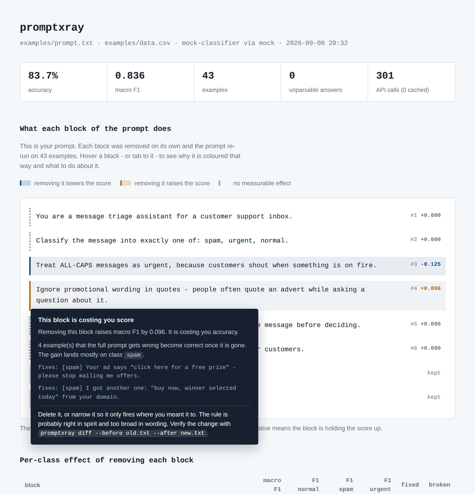

# promptxray

[](https://github.com/godwire/promptxray/actions/workflows/ci.yml)
[](https://pypi.org/project/promptxray/)
[](https://pypi.org/project/promptxray/)
[](LICENSE)

Find out which line of your prompt is causing your classifier's errors.

Every eval tool tells you your prompt scores 0.83. None of them tell you *which
part of the prompt* earned that number. promptxray removes each block of your
prompt one at a time, re-runs the dataset, and shows you the damage.



The report is your prompt, coloured block by block. Blue means the score drops
without that block. Amber means the score goes *up* without it. Hover any block
and it tells you why it got that colour, which examples flipped, and what to do
about it.

**[Open the live demo report](https://godwire.github.io/promptxray/)** and hover
the blocks yourself.

## The 30-second version

No API key needed for the demo — a built-in mock classifier lets you see the
whole thing work offline.

```bash
pip install promptxray

promptxray ablate \
  --prompt examples/prompt.txt \
  --data examples/data.csv \
  --provider mock \
  --report report.html
```

```
baseline macro F1 0.836 on 43 examples

  #3   -0.125  90% CI [-0.222, -0.051]  carries its weight   Treat ALL-CAPS messages as...
  #1   +0.000  90% CI [+0.000, +0.000]  no effect            You are a message triage...
  #2   +0.000  90% CI [+0.000, +0.000]  no effect            Classify the message into...
  #5   +0.000  90% CI [+0.000, +0.000]  no effect            Be thorough and think...
  #6   +0.000  90% CI [+0.000, +0.000]  no effect            Remember that accuracy...
  #4   +0.096  90% CI [+0.025, +0.185]  hurts the score      Ignore promotional wording...

4 of 6 tested blocks changed nothing at all.
```

Read that bottom line again. Two thirds of that prompt is decoration, and one
instruction someone added in good faith is actively costing 0.096 macro F1.

## How it works

The technique is occlusion, borrowed from explainable ML. There you hide one
input feature and watch the prediction move; here the features are the blocks
of your prompt.

1. Your prompt is split into blocks on blank lines. One block is one
   instruction, one few-shot example, or one formatting rule.
2. The full prompt runs over your labelled dataset. That is the baseline.
3. Each block is removed on its own and the prompt is re-run.
4. The change in macro F1, and the individual examples that flipped, are
   attributed to that block.

Every delta comes with a 90% confidence interval, produced by resampling the
tested examples. When that interval crosses zero the tool says so instead of
guessing: a block is only called useful or harmful when the sign survives
resampling. This is the difference between a measurement and a coin flip on a
small dataset.

Two things keep this affordable:

**Error-enriched subsets.** Ablated runs use `--subset-size` examples, not the
whole dataset: every example the baseline got wrong, plus a sample of the ones
it got right so that a block which *breaks* working cases still shows up. Every
delta is measured against the baseline on that same subset, never against the
full-dataset number.

**A disk cache.** Every answer is stored under a hash of the exact prompt text
and model. Change one block and only that block's run costs money; run the same
thing twice and the second run is free.

## Commands

### `run` — score a prompt

```bash
promptxray run --prompt prompt.txt --data data.csv \
  --provider openai --model gpt-4o-mini --report report.html
```

### `ablate` — measure what every block does

```bash
promptxray ablate --prompt prompt.txt --data data.csv \
  --provider openai --model gpt-4o-mini \
  --subset-size 60 --report report.html
```

### `suggest` — find the smallest prompt that does the same job

```bash
promptxray suggest --prompt prompt.txt --data data.csv \
  --provider ollama --model llama3.2 --holdout 0.3 --price-per-mtok 0.15
```

```
blocks judged on 30 training examples, result measured on 13 held-out examples

removed 5 of 8 blocks, one at a time:
   1. #4   was costing +0.101 F1     Ignore promotional wording in quotes - peo...
   2. #5   no measurable effect      Be thorough and think carefully about the...
   3. #6   no measurable effect      Remember that accuracy matters a lot to ou...
   4. #1   no measurable effect      You are a message triage assistant for a c...
   5. #2   no measurable effect      Classify the message into exactly one of:...

original  macro F1 0.764
suggested macro F1 0.849 (+0.085) on the holdout
fixed 1, broken 0

prompt tokens per call  144 -> 47  (67% less)
per million calls       97M fewer input tokens
                        $14.49 saved at $0.15/1M input tokens
```

Three things make this trustworthy rather than just short:

**It removes one block at a time.** Leave-one-out ablation has a blind spot:
when two blocks say the same thing, removing either one alone changes nothing,
so both look useless — and cutting both at once breaks the prompt. `suggest`
drops the weakest block, re-measures what is left, and repeats. The moment a
block starts to matter because its twin is gone, it stays, and the pair is
named in the output. `--strategy one-shot` skips this for a cheaper run.

**It grades on data it did not choose with.** Blocks are judged on the
training part of your dataset; the final prompt is scored on a holdout the
selection never saw. If the shorter prompt loses score there, nothing is
written.

**It keeps what it cannot judge.** A block whose confidence interval crosses
zero is kept. Unproven is not the same as useless — gather more examples if you
want a verdict on it.

The saving is measured, not guessed: token counts come from what the provider
reports for each call. When a provider reports nothing, the figure is marked
`~` and estimated at four characters per token.

### `diff` — compare two prompt versions, example by example

Aggregate metrics hide the trade. This shows you exactly what you gained and
what you quietly broke.

Delete the block `ablate` blamed, and check the result:

```bash
promptxray diff --before examples/prompt.txt --after examples/prompt_v2.txt \
  --data examples/data.csv --provider mock --fail-under 0.80
```

```
prompt.txt:    macro F1 0.836
prompt_v2.txt: macro F1 0.932 (+0.096)

fixed  4
  + [spam] Your ad says "click here for a free prize" - please stop mailing me...
  + [spam] I got another one: "buy now, winner selected today" from your domain.
  + [spam] Message reads "FREE upgrade, click here" and it came from your server.
  + [spam] Third copy of "claim your prize now" offer this week.
broken 0
```

`--fail-under` exits with code 1, so this works as a CI gate on prompt changes.

## In CI: the GitHub Action

Block a pull request when a prompt change makes the classifier worse. Free,
with no API key: the action installs Ollama on the runner and runs an open
model there.

```yaml
# .github/workflows/prompt-check.yml
name: prompt check
on: pull_request

jobs:
  promptxray:
    runs-on: ubuntu-latest
    steps:
      - uses: actions/checkout@v4
        with:
          fetch-depth: 0
      - run: git show origin/${{ github.base_ref }}:prompts/triage.txt > /tmp/before.txt
      - uses: godwire/promptxray@v0.3.0
        with:
          command: diff
          before: /tmp/before.txt
          prompt: prompts/triage.txt
          data: tests/labelled.csv
          provider: ollama
          model: qwen2.5:1.5b
          fail-under: "0.80"
```

The fixed and broken examples land in the job summary. With `command: ablate`
the HTML report is attached to the run as a downloadable artifact. Hosted
providers work too: pass the key through `env:` from your repository secrets.

## A harder example

`examples/case-study/` holds a real one: 100 labelled messages from a game
chat, three classes, and a fourteen-block moderation prompt written the way
prompts actually get written. Two of its rules are overbroad on purpose. Run
the ablation and see whether the tool finds them before you do.

See [examples/case-study/RUNBOOK.md](examples/case-study/RUNBOOK.md).

No local setup at all: fork the repository, open **Actions → real model → Run
workflow**, and GitHub runs the case study against an open model on its own
machines. The report is attached to the run.

## Writing a prompt file

Plain text. Blocks are separated by blank lines.

```
You are a message triage assistant.

Classify the message into exactly one of: spam, urgent, normal.

Treat ALL-CAPS messages as urgent.

Answer with the single label and nothing else. [[keep]]

Text: {input}
```

- `{input}` is where each row of your dataset goes. Required.
- `[[keep]]` pins a block so it is never removed. Use it on the output-format
  instruction: deleting that one does not test an idea, it just breaks parsing
  and produces a meaningless delta.
- Blocks containing `{input}` are pinned automatically.

## Dataset format

CSV or JSONL with a text column and a label column:

```csv
text,label
"Buy now and get 70% off",spam
"When is my next invoice?",normal
```

Different column names: `--text-column message --label-column category`.

## Providers

You never have to pay to use this tool. The first three cost nothing:

| `--provider` | What it is | Cost | Credentials |
| --- | --- | --- | --- |
| `mock` | Built-in fake classifier for the demo and CI | free | none |
| `ollama` | Local models on your own machine | free | none |
| `lmstudio` | Same, via LM Studio | free | none |
| `openrouter` | Hosted; has free models (`:free` suffix) | free tier | `OPENROUTER_API_KEY` |
| `groq` | Hosted, fast | free tier | `GROQ_API_KEY` |
| `gemini` | Google's Gemini models | free tier | `GEMINI_API_KEY` |
| `openai` | OpenAI and compatible servers | paid | `OPENAI_API_KEY` |
| `anthropic` | Claude | paid | `ANTHROPIC_API_KEY` |

The free path, start to finish — install [Ollama](https://ollama.com), then:

```bash
ollama pull llama3.2

promptxray ablate --prompt prompt.txt --data data.csv \
  --provider ollama --model llama3.2
```

Nothing leaves your machine and nothing is billed. Any OpenAI-compatible server
works via `--base-url`.

## What it costs

Nothing, if you run a local model. The number of calls still decides how long
you wait:

| command | calls on the first run |
| --- | --- |
| `ablate` | `dataset + blocks × subset` — 200 rows, 10 blocks, subset 60 is 800 |
| `suggest --strategy one-shot` | about the same as `ablate` |
| `suggest` (greedy) | up to `blocks² / 2 × subset`; printed before the run starts |

Every answer is cached under a hash of the exact prompt and model, so a second
run of anything costs zero calls.

## What this is not

Not an observability platform, not a tracing backend, not a judge framework.
No server, no account, no dashboard. It is a library and a CLI that answer one
question, and the report is a single HTML file you can commit, mail, or attach
to a pull request.

For tracing and production monitoring, use Langfuse or Phoenix. For adversarial
red-teaming, use promptfoo. promptxray fits in between: you have a prompt, you
have labelled data, and you want to know which line is pulling its weight.

## Development

```bash
git clone https://github.com/godwire/promptxray
cd promptxray
pip install -e ".[dev]"
pytest
ruff check src tests
```

The test suite runs entirely on the mock provider, so it needs no network and
no API key. See [CONTRIBUTING.md](CONTRIBUTING.md) before opening a pull
request.

## License

MIT
